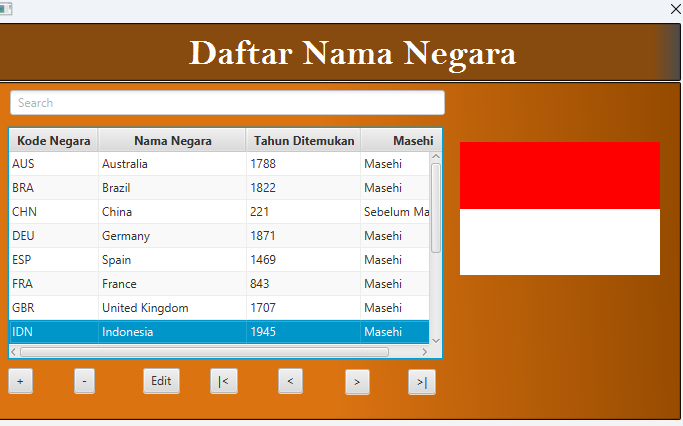
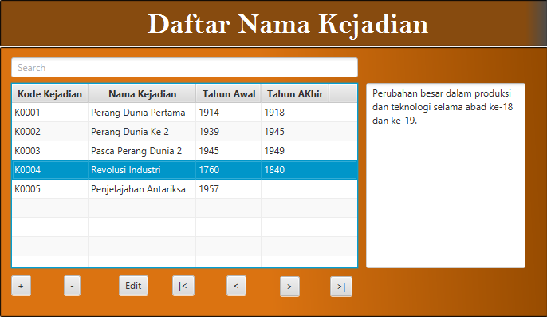
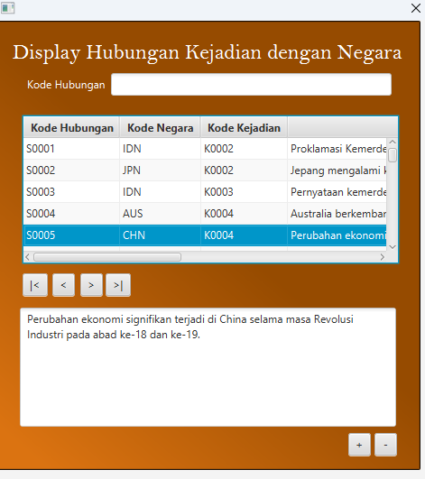
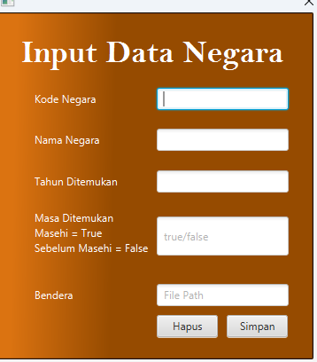
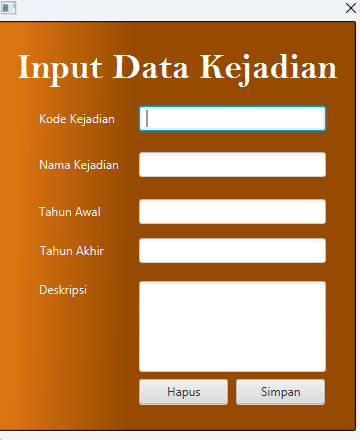
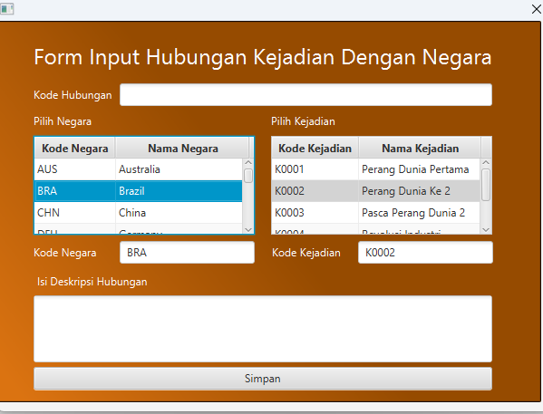
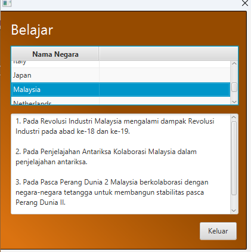
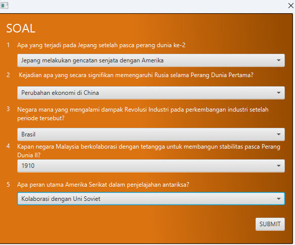

# 🏛️ Interactive History Learning Application

An educational desktop application built with **Java Swing** to support interactive history learning.  
Developed as part of an academic project to apply **Object-Oriented Programming (OOP)** concepts and GUI programming in Java.

---

## 📚 Overview

This application helps users learn history interactively through data exploration and quizzes.  
It manages **countries**, **historical events**, and their **relationships**, allowing users to input, view, and connect information easily.

---

## ⚙️ Features

### 🗂️ Data Display and Editing
- **Display Negara** – display and edit a list of countries  
- **Display Kejadian** – display and edit a list of historical events  
- **Display Hubungan** – show the relationship between countries and events  

### 📝 Data Input Forms
- **Input Negara** – add new country data  
- **Input Kejadian** – add new historical event data  
- **Input Hubungan** – create a link between existing countries and events (must already exist in data negara and data kejadian)  

### 🧭 Learning Mode
- **Belajar** – allows users to click on a country and view all related historical events  

### 🧩 Quiz Mode
- **Kuis** – provides multiple-choice questions based on available data to help reinforce learning  

---

## 🖼️ Application Interface

Below are the main interfaces implemented in the application:

### 📘 Data Displays
**Country List**  

**Event List**  

**Country–Event Relationship**  

---

### ✏️ Input Forms
**Add Country**  

**Add Event**  

**Add Relationship**  

---

### 🎓 Learning and Quiz Features
**Learning by Country**  

**Quiz Feature**  

---

## 🧠 Implementation Details
- Built using **Java Swing** for the graphical user interface  
- Applies **OOP principles** for data structure and modular design  
- Uses **File I/O** for saving and loading data  
- Focuses on interactivity and user-friendly educational experience  

---

## 🧩 Tech Stack
- **Language:** Java  
- **Framework:** Java Swing  
- **Concepts:** OOP, File I/O, GUI Programming, Data Relationship Mapping  

---

## 👨‍💻 Author
**Frendi Widsna**  
Bachelor of Informatics Engineering, STMIK LIKMI – Bandung  
[LinkedIn](https://www.linkedin.com/in/frendi-widsna-36b000267) | [GitHub](https://github.com/FingrenF)
